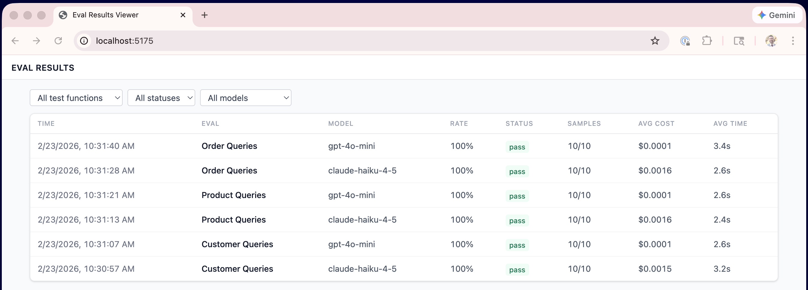
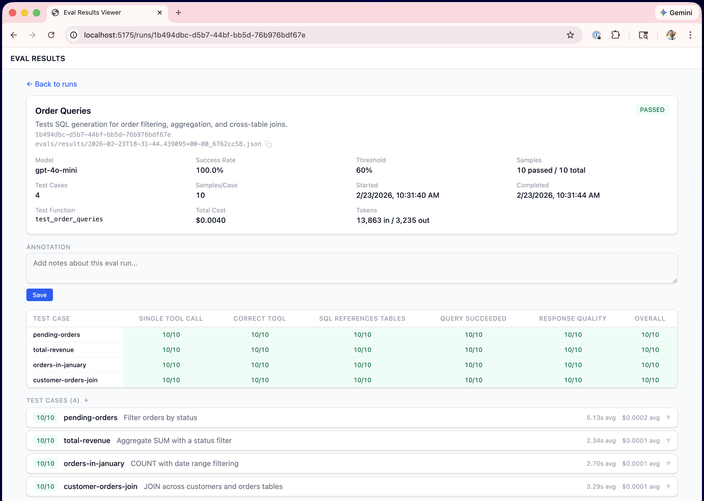

# flex-evals-viewer

Template repository for evaluating LLM-based agents with [flex-evals](https://github.com/shanekercheval/flex-evals) using `@evaluate` pytest decorator, plus a web viewer for exploring results.

## Why This Template

Building an LLM agent is easy. Knowing whether it actually works - reliably, across models, across edge cases - is hard. This template gives you a working eval pipeline out of the box: an example agent, a suite of checks, and a web viewer to drill into every sample. Fork it, swap in your own agent, and start evaluating.

**Eval runs list** - compare models, success rates, costs, and timing at a glance:



**Run detail** - summary matrix showing pass/fail per test case per check, with drill-down into individual samples:



**Check details** - expand any check to see results, including LLM judge reasoning:


## How It Works

### flex-evals and `@evaluate`

[flex-evals](https://github.com/shanekercheval/flex-evals) is a lightweight evaluation framework that is largely agnostic to your test infrastructure. It provides an `@evaluate` decorator built on top of pytest, which wraps a test function to:

1. Execute the test function for each **test case**, repeating each one N times (**samples**) to measure consistency since LLM outputs are non-deterministic. Test cases can be defined however you like, but YAML is a convenient option (as shown in this template).
2. Run a set of **checks** against every sample's output automatically (e.g. "did the agent call the right tool?", "does the SQL reference the right tables?", "did an LLM judge approve the response?").
3. Run everything **concurrently** - all test cases across all samples execute in parallel. 5 test cases x 10 samples = 50 concurrent executions.
4. Aggregate results and fail/pass the test based on a **success threshold** (e.g. 60% of samples must pass all checks).
5. Save detailed JSON results (every sample, every check, all metadata) that you can explore in the **web viewer** and/or hand to an agent like Claude Code for analysis.

### `@pytest.mark.parametrize` for Configuration Variants

`@evaluate` composes naturally with `@pytest.mark.parametrize`, which lets you evaluate across any combination of configuration values - models, temperatures, agent settings, etc. In this template, we parametrize across models (e.g. `claude-haiku-4-5` and `gpt-4o-mini`) as a simple example. Each combination produces a separate result file, so you can directly compare how different configurations (e.g. models) perform on the same tasks.

### The Example Agent: Database Q&A

The included agent is a two-phase **database Q&A agent** that answers natural language questions about an in-memory SQLite e-commerce database (customers, products, orders).

**Phase 1 - SQL Generation:** The agent receives a question and uses **tool calling** (`generate_sql` tool with `ToolChoice.REQUIRED`) to produce a SQL query. The LLM sees the full database schema in its system prompt and must generate valid SQL.

**Phase 2 - Response Generation:** The generated SQL is executed against the real database. The query results (or error) are passed back to the LLM, which produces a natural language answer.

This is deliberately more complex than a simple Q&A agent - it exercises tool calling, real execution, and multi-step reasoning, which means evals won't always get perfect scores. That's the point.

### What Gets Tested

Test cases are organized into three categories in `evals/agent_evals.yaml`:

| Category | Examples | What it exercises |
|---|---|---|
| **Customer Queries** | "How many customers?", "Email of Alice Johnson?" | COUNT, WHERE, single-table lookups |
| **Product Queries** | "Top 3 most expensive products?" | ORDER BY, LIMIT, category filtering |
| **Order Queries** | "Total revenue from completed orders?", "Which customers have placed orders?" | SUM, date filtering, JOINs |

### What Gets Checked

Every sample is validated by 5 checks, all defined in YAML:

| Check | Type | What it verifies |
|---|---|---|
| **Single Tool Call** | `equals` | Agent predicted exactly one tool call |
| **Correct Tool** | `exact_match` | Agent selected the `generate_sql` tool |
| **SQL References Tables** | `contains` | Generated SQL references the expected tables |
| **Query Succeeded** | `equals` | SQL executed without errors |
| **Response Quality** | `llm_judge` | An LLM judge evaluates whether the response correctly answers the question |

Checks use **JSONPath** expressions (e.g. `$.output.value.sql_query`) to extract values from the test case and agent output, so they're reusable across test cases without writing Python.

### High-Level Workflow

```
YAML config                   pytest + @evaluate              JSON results
─────────────                 ──────────────────              ────────────
test cases                    for each model:                 per-model, per-category
  questions + expected  ───>    for each test case:     ───>  result files with every
checks                            run agent N times           sample, check, and
  structural + llm_judge          run checks on each          usage detail
models                            aggregate pass/fail
  provider, name, temp
```

Then open the **viewer** to browse runs, compare models, and drill into individual samples and check results.

## Setup

```bash
# Install Python dependencies
make install

# Install dev dependencies (pytest, ruff, etc.)
make install-dev
```

Create a `.env` file with your API keys:

```
ANTHROPIC_API_KEY=sk-ant-...
OPENAI_API_KEY=sk-...
```

## Running Evals

```bash
make evals
```

Runs 3 test categories x 2 models x 10 samples each. Results are saved as JSON to `evals/results/`.

## Viewing Results

```bash
# Install viewer dependencies (first time only)
make eval-viewer-install

# Start the viewer
make eval-viewer
```

Open http://localhost:5174 to browse runs with filtering, sample drill-down, and check details.

## Project Structure

```
agent/
  agent.py              # Two-phase SQL agent (tool calling + response generation)
  database.py           # SQLite schema, seed data, and query execution
evals/
  agent_evals.yaml      # Test cases, checks, models, and eval config
  test_agent.py         # @evaluate test functions (one per category)
  conftest.py           # YAML loading, config helpers, .env setup
  results/              # JSON result files (generated by make evals)
viewer/                 # React + Express eval results viewer
```

## Linting

```bash
make lint
```
